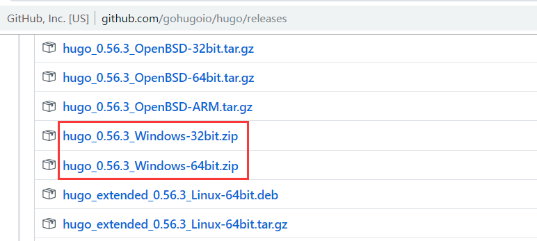
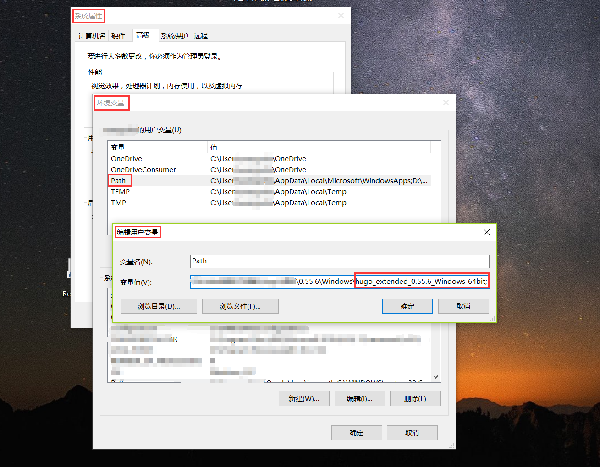
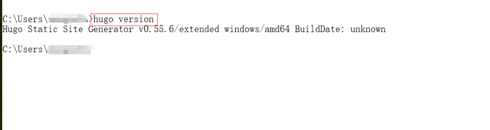
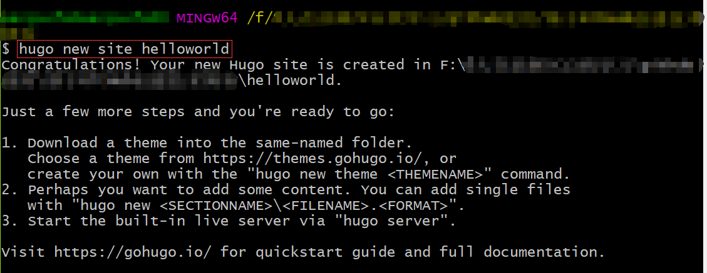
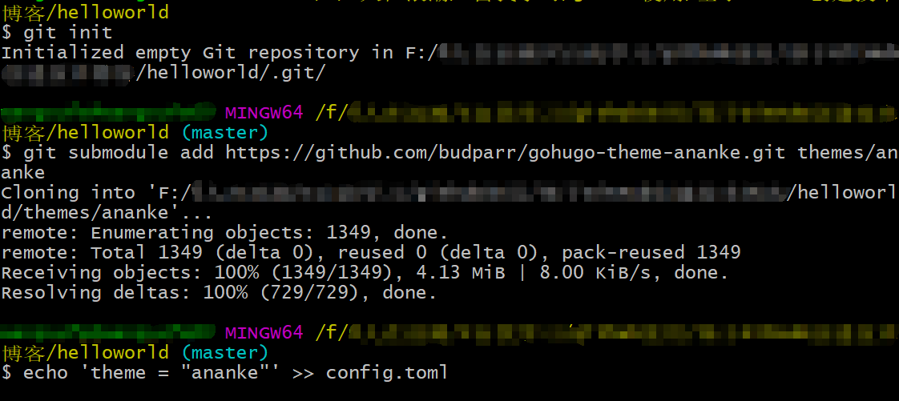
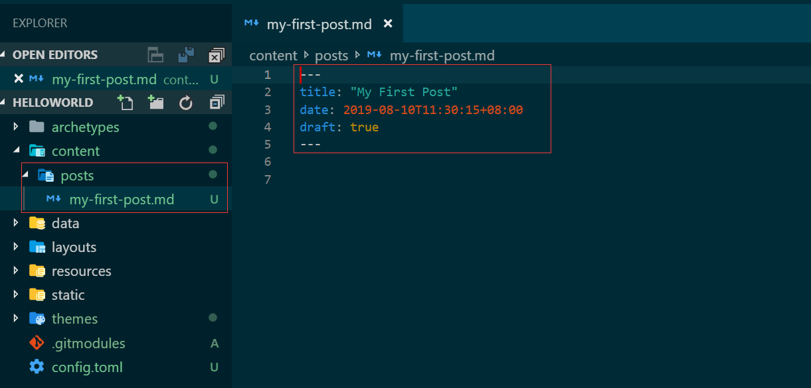
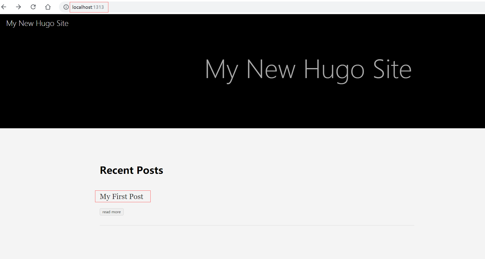
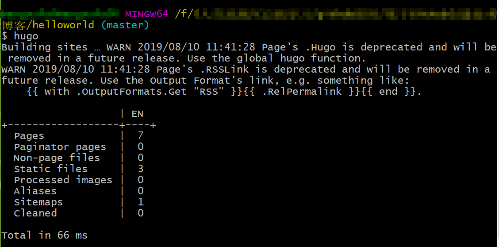

# Hugo 简介
Hugo [官网](https://gohugo.io/)对其描述如下：  
Hugo is a static website generator written in Go. It is optimized for speed, ease of use, and configurability. Hugo takes a directory with content and templates and renders them into a full HTML website.  
Hugo宣称有如下特性：  
(1) Blistering Speed(生成速度快)   
Hugo is the fastest tool of its kind. At <1 ms per page, the average site builds in less than a second.  
(2) Shortcodes（短代码）  
Hugo's shortcodes are Markdown's hidden superpower. We love the beautiful simplicity of markdown’s syntax, but there are times when we want more flexibility. Hugo shortcodes allow for both beauty and flexibility.  
(3) Robust Content Management（内容管理鲁棒性）  
Hugo supports unlimited content types, taxonomies, menus, dynamic API-driven content, and more, all without plugins.  
(4) Built-in Templates(内置多种模板)  
Hugo ships with pre-made templates to make quick work of SEO, commenting, analytics and other functions. One line of code, and you're done.  
(5) Multilingual and i18n（支持多语）  
Hugo provides full i18n support for multi-language sites with the same straightforward development experience Hugo users love in single-language sites.  
(6) Custom Outputs（自定义输出）  
Hugo allows you to output your content in multiple formats, including JSON or AMP, and makes it easy to create your own.  
# Hugo 安装  
作为一款性能优良、简单易用、高灵活度的静态网站生成工具，Hugo 吸引越来越多的希望独立构建静态网站的用户。但摆在这些用户前面的第一个问题是：如何安装 Hugo。Hugo 的安装可参考[Hugo官网文档](https://gohugo.io/getting-started/installing/)。Hugo 可运行在任何支持 Go 语言编译器的操作系统上，如 MacOS, Windows, Linux, OpenBSD, FreeBSD 等。  
Hugo 即支持编译安装也支持绿色安装。这里仅介绍绿色安装，更多编译安装，如在[ MacOS 上编译安装 Hugo](https://gohugo.io/getting-started/installing/#homebrew-macos), 可参考 Hugo 官网。  
## 绿色安装 Hugo
Hugo 官网提供了已编译版本，只需将可执行程序路径配置到环境变量中。不同操作系统的预编译版本可从[ Hugo 官方 GitHub 仓库](https://github.com/gohugoio/hugo/releases)中获取。这里以Windows OS 为例，简单介绍下如何在 Windows 下安装绿色版 Hugo。  
1. 下载 Hugo 绿色版  
从发版仓库中下载符合当前操作系统版本的Hugo版本。这里以Window x64为例。  

2. 配置环境变量

3. 查看Hugo安装版本
如何检测Hugo是否安装成功？可在命令行中通过执行`` hugo version ``查看使用的Hugo版本。  
  
# 使用 Hugo 创建第一个静态网站
安装完Hugo后，接下来简单介绍下如何使用 Hugo 创建第一个静态网站，更多使用说明可参考[Hugo官网](https://gohugo.io/getting-started/quick-start/)。  
## 创建一个新网站  
使用Hugo工程创建命令，创建一个工程。  
```
hugo new site helloworld
```
  
## 添加主题  
Hugo 创建的静态网站依赖符合 Hugo 规范的主题。可从[Hugo主题官网](https://themes.gohugo.io/)获取所需主题。在选用主题时，要考虑主题的现有功能和发展生态，以满足后续不断增长的需求。  
使用 git 拉取主题。这里已官网推荐的Ananke theme为例，介绍如如何向Hugo工程中添加主题。  
(1) 下载主题
``` 
git init
git submodule add https://github.com/budparr/gohugo-theme-ananke.git themes/ananke
```  
(2) 向工程配置文件中添加主题
```
echo 'theme = "ananke"' >> config.toml
```
  
## 添加内容
完成主题添加后，接下来就可编写内容。也可通过 Hugo 命令创建文件模板。
```
hugo new posts/my-first-post.md
```
  
## 本地调试
完成内容添加后，接下来就需要调试，作为发布前检测。执行命令为：  
```
hugo server -D
```
开发模式下，会占用1313端口。访问http://localhost:1313/网址，可以预览发布效果。  

## 构建静态网页
完成调试后，接下来就可生成静态网站，进而将静态网站部署到指定站点。构建静态网站的命令是：
```
hugo
```
默认情况下，构建的静态网站会放在public目录下，拷贝该文件中内容到站点中指定目录，就完成了静态网页的发布。  
