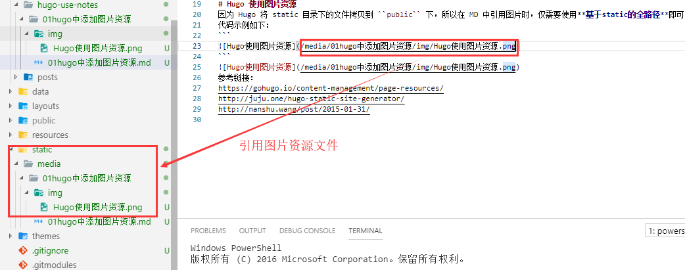

基于 ``Hugo`` 实现简单的博客展示后，遇到的第一个使用上的问题就是，``如何将md中引用的图片资源添加到Hugo中``。  
# Hugo 生成页面流程简介
在介绍"Hugo中添加并使用图片资源"前，先简要下Hugo在生成页面时，执行流程。 Hugo在生成页面时，主要经历以下流程:  
1. 拷贝静态资源到public文件夹，包括：  
拷贝 ``theme/static/*`` 到 ``public/``下  
拷贝 ``static/*`` 到 ``public/``下
2. 遍历所有content/下所有文件。具体操作如下：  
获取文件头信息，并把正文markdown转换为html
4. 渲染生成相关页面。  
渲染已生成页面对应的**正文页面**，生成文件夹对应的**列表页面**，生成**分类页面**，生成**主页**。  
# Hugo 使用图片资源  
因为 Hugo 将 static 目录下的文件拷贝到 ``public`` 下，所以在 MD 中引用图片时，仅需要使用**基于static的全路径**即可。  
代码示例如下：
```

```
  
注意：必须将生成路径指定到public下（默认情况下，不许手动设置），才能保证static中资源文件生成到待发布的网站中。原因目前未知。  
参考链接：  
https://gohugo.io/content-management/page-resources/  
http://juju.one/hugo-static-site-generator/  
http://nanshu.wang/post/2015-01-31/  
